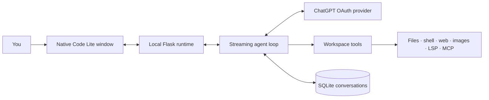

<p align="center">
  
</p>

<h1 align="center">Code Lite</h1>

<p align="center">
  <strong>A fast, lightweight coding agent for your local projects.</strong><br />
  Sign in with ChatGPT. Work in a native desktop window. Keep control of every risky action.
</p>

<p align="center">
  <a href="https://github.com/pythonIsFast/CodeLite/blob/main/LICENSE"></a>
  
  
  
</p>

<p align="center">
  <a href="#get-started">Get started</a> · <a href="#what-it-can-do">Features</a> · <a href="#safety-you-control">Safety</a> · <a href="#extend-a-project">Extensions</a> · <a href="#architecture">Architecture</a>
</p>

---

> [!IMPORTANT]
> Code Lite uses your existing **ChatGPT sign-in**, not an API key or API credits. It keeps its own OAuth session and never reads or overwrites Codex CLI authentication.

## Why Code Lite?

Most coding agents are either heavy desktop applications or thin terminal wrappers. Code Lite aims for a different balance: a capable local agent with a compact Python runtime, no Electron bundle, and an interface that stays out of the way.

| | Code Lite |
|---|---|
| **Desktop app** | Native OS webview via pywebview — no bundled Chromium |
| **Account** | Sign in with ChatGPT; tokens are stored separately in Code Lite's data directory |
| **Agent loop** | Streaming model → tool → result → model workflow with automatic context compaction |
| **Safety** | Per-action approvals, scoped session grants, and an optional command judge |
| **Project context** | Instructions, memory, skills, MCP, and LSP — all lazy and bounded |
| **Footprint** | Vanilla HTML/CSS/JS, Flask, pywebview, and a deliberately small dependency set |

## Get started

### 1. Install

```bash
git clone https://github.com/pythonIsFast/CodeLite.git
cd CodeLite
pip install -r requirements.txt
```

### 2. Run

```bash
python3 run.py
```

On first launch, select **Sign in with ChatGPT**. The browser completes OAuth and Code Lite stores its own session at `~/.local/share/codelite/auth.json` by default.

<details>
<summary><strong>Useful launch modes</strong></summary>

```bash
# Start with automatic file writes, but still ask for shell commands.
python3 run.py --mode permit_writes

# Select a model explicitly.
python3 run.py --model gpt-5.6-sol

# Serve the app without opening a native window.
python3 run.py --headless

# Run only the small OpenAI-compatible local provider.
python3 -m codelite.provider
```

</details>

## What it can do

### Build, inspect, and change projects

| Capability | What the agent can do |
|---|---|
| **Files & search** | Read, write, precisely edit, list, grep, and glob files inside the workspace |
| **Terminal** | Run commands with the working directory carried across calls |
| **Code intelligence** | Ask installed language servers for diagnostics, definitions, references, and symbols |
| **Planning** | Keep a visible step-by-step task list for longer work |
| **Clarification** | Pause to ask you a focused question with choices or a typed answer |

### Use the web and work with media

| Capability | How it stays practical |
|---|---|
| **Web search & fetch** | Searches public pages and converts HTML, text, or JSON into bounded readable output |
| **Generate images** | Creates an image through the signed-in ChatGPT account and saves it in the workspace |
| **See images** | Supplies the actual pixels of a workspace image to the model for the next turn |
| **Showcase files** | Renders workspace images, video, audio, and files directly in the chat |

### Let Auto choose the right model

Choose **Auto** in the model picker and Code Lite uses a lightweight routing step before every turn. Routine work stays economical; larger refactors, debugging, and higher-risk changes can receive a more capable model. The selected model (Luna, Terra, or Sol) and reason remain visible in chat, and routing falls back to the balanced option instead of defaulting to the most expensive model.

## Safety you control

Reads are always safe. File changes and terminal commands follow the permission mode of the current conversation.

| Mode | File changes | Shell commands |
|---|---|---|
| `ask` | Ask every time | Ask every time |
| `permit_writes` | Allow | Ask every time |
| `auto` | Allow | A separate safety check reviews each command, then escalates if needed |
| `bypass` | Allow | Allow |

When Code Lite asks, you can approve once, approve a narrow scope for this chat, or deny with feedback. Write approvals include the actual unified diff. Shell grants are restricted to the exact normalized command and working directory; write grants are restricted to the displayed directory.

> [!TIP]
> `auto` does not silently ignore a blocked command. It shows why the safety check rejected it and lets you make the final decision.

## Project intelligence, without the bloat

Code Lite loads useful project context only when it is needed and keeps every injected source bounded.

| Source | Location | Behaviour |
|---|---|---|
| **Global memory** | Code Lite data directory: `memory.md` | Personal preferences that apply to every project |
| **Project memory** | `.codelite/memory.md` | Commands, conventions, and architecture shared by the workspace |
| **Repository instructions** | `AGENTS.md`, `CLAUDE.md` | Collected before a run; nested applicable instructions are included |
| **Skills** | `.codelite/skills/` | Only summaries enter the prompt; full guidance loads on demand |
| **MCP** | `.codelite/mcp.json` | Stdio servers start only when their tools are used |
| **LSP** | `.codelite/lsp.json` | Language servers start on their first code-intelligence request |

The settings panel separates account, global memory, project configuration, and import. Global memory works even before a project chat exists.

## Bring your Codex history along

**Settings → Import** reads every session the official Codex CLI recorded under
`~/.codex` and turns each one into a conversation here, keeping its original
date, workspace, and token counts. Each import records which session it came
from, so running it again picks up only what is new.

Imported chats are history rather than resumable state, and the reason is worth
stating: Codex's tool calls name Codex's own tools, and its reasoning items are
encrypted against the response chain they came from. Sending either back would
be an invalid request, not a cosmetic mismatch. So tool calls arrive as readable
text and the encrypted reasoning is left out. Nothing that was said is lost.

## Extend a project

### Local tools and hooks

Drop project-specific Python extensions into `.codelite/tools/*.py` or `.codelite/plugins/*.py`. Discovery reads only literal metadata; the module itself is imported only when the tool or hook is actually used, through the normal command-permission policy.

```python
TOOL = {
    "name": "hello",
    "description": "Return a project-specific greeting.",
    "parameters": {
        "type": "object",
        "properties": {"name": {"type": "string"}},
        "required": ["name"],
        "additionalProperties": False,
    },
}

def run(arguments, context):
    return f"Hello {arguments['name']}"
```

Plugins can expose `before_tool` and `after_tool` hooks. They may replace arguments or output, but cannot replace a built-in tool name. Extensions are capped at 32 files per project.

### MCP and custom LSP servers

<details>
<summary><strong>Example MCP configuration</strong></summary>

```json
{
  "mcpServers": {
    "example": {"command": "example-mcp-server", "args": ["--stdio"]}
  }
}
```

</details>

<details>
<summary><strong>Example LSP configuration</strong></summary>

```json
{
  "servers": {
    "custom-python": {
      "command": ".venv/bin/pyright-langserver",
      "args": ["--stdio"],
      "extensions": [".py"],
      "languageId": "python"
    }
  }
}
```

</details>

## Architecture



| Layer | Responsibility | Design |
|---|---|---|
| `codelite.provider` | ChatGPT OAuth, token refresh, Responses transport, images, optional local proxy | Standard-library only |
| `codelite.agent` | Agent loop, prompts, routing, compaction, and tool orchestration | Streaming, context-aware workflow |
| `codelite.tools` | Filesystem, shell, search, web, image, memory, planning, and questions | Workspace-scoped and permission-aware |
| `codelite.app` | Flask runtime, SSE, SQLite-backed conversations, and native window | Flask + pywebview desktop layer |

The provider layer is a from-scratch Python implementation inspired by [EvanZhouDev/openai-oauth](https://github.com/EvanZhouDev/openai-oauth). The agent-loop structure took inspiration from [OpenCode](https://github.com/anomalyco/opencode). See [NOTICE](NOTICE) for attribution.

## Deliberate constraints

- The app binds to localhost only; it is a private desktop backend, not a network service.
- Shell calls are separate processes. Code Lite carries the working directory between calls, not environment mutations, functions, or background jobs.
- Web tools reject private, local, reserved, and credential-bearing destinations. Downloads and returned text are capped.
- Context usage is tracked per conversation. Before the model reaches its input limit, older working context is compacted while the original transcript remains stored and visible.
- pywebview needs a system webview backend: WebKitGTK on Linux or WebView2 on Windows.

## Project layout

```text
run.py            Start the app from anywhere
codelite/
  provider/       OAuth, transport, SSE, images, limits, proxy
  agent/          Agent loop, prompts, routing, safety judge
  tools/          Built-in and project-local capabilities
  integrations/   Lazy MCP and LSP stdio clients
  project/        Memory, instructions, skills, plugins
  permission/     Modes and scoped approval manager
  db/             SQLite conversation store
  importer.py     Codex session history import
  app/            Runtime, server, native window, vanilla UI
```

## License

Apache License 2.0 — see [LICENSE](LICENSE) and [NOTICE](NOTICE).
