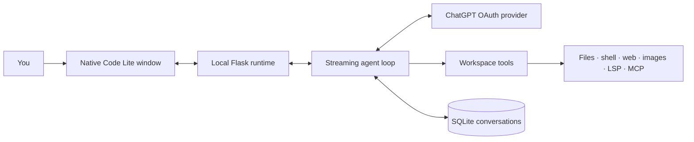

<p align="center">
  
</p>

<h1 align="center">Code Lite</h1>

<p align="center">
  <strong>A fast, lightweight coding agent for your local projects.</strong><br />
  Sign in with ChatGPT. Work in a native desktop window. Keep control of every risky action.
</p>

<p align="center">
  <a href="https://github.com/pythonIsFast/CodeLite/blob/main/LICENSE"></a>
  
  
  
</p>

<p align="center">
  <a href="#get-started">Get started</a> · <a href="#what-it-can-do">Features</a> · <a href="#safety-you-control">Safety</a> · <a href="#extend-a-project">Extensions</a> · <a href="#architecture">Architecture</a>
</p>

---

> [!IMPORTANT]
> Code Lite uses your existing **ChatGPT sign-in**, not an API key or API credits. It keeps its own OAuth session and never reads or overwrites Codex CLI authentication.

## Why Code Lite?

Most coding agents are either heavy desktop applications or thin terminal wrappers. Code Lite aims for a different balance: a capable local agent with a compact Python runtime, no Electron bundle, and an interface that stays out of the way.

| | Code Lite |
|---|---|
| **Desktop app** | Native OS webview via pywebview — no bundled Chromium |
| **Account** | Sign in with ChatGPT; tokens are stored separately in Code Lite's data directory |
| **Agent loop** | Streaming model → tool → result → model workflow with automatic context compaction |
| **Safety** | Per-action approvals, scoped session grants, and an optional command judge |
| **Project context** | Instructions, memory, skills, MCP, and LSP — all lazy and bounded |
| **Footprint** | Vanilla HTML/CSS/JS, Flask, pywebview, and a deliberately small dependency set |

## Get started

### 1. Install

```bash
git clone https://github.com/pythonIsFast/CodeLite.git
cd CodeLite
pip install -r requirements.txt
```

### 2. Run

```bash
python3 run.py
```

On first launch, select **Sign in with ChatGPT**. The browser completes OAuth and Code Lite stores its own session at `~/.local/share/codelite/auth.json` by default.

<details>
<summary><strong>Useful launch modes</strong></summary>

```bash
# Start with automatic file writes, but still ask for shell commands.
python3 run.py --mode permit_writes

# Select a model explicitly.
python3 run.py --model gpt-5.6-sol

# Serve the app without opening a native window.
python3 run.py --headless

# Run only the small OpenAI-compatible local provider.
python3 -m codelite.provider
```

</details>

## What it can do

### Build, inspect, and change projects

| Capability | What the agent can do |
|---|---|
| **Files & search** | Read, write, precisely edit, list, grep, and glob files inside the workspace |
| **Terminal** | Run commands with the working directory carried across calls |
| **Code intelligence** | Ask installed language servers for diagnostics, definitions, references, and symbols |
| **Planning** | Keep a visible step-by-step task list for longer work |
| **Clarification** | Pause to ask you a focused question with choices or a typed answer |

### Use the web and work with media

| Capability | How it stays practical |
|---|---|
| **Web search & fetch** | Searches public pages and converts HTML, text, or JSON into bounded readable output |
| **Hidden browser** | Drives a hidden system-webview window for pages `web_fetch` can't read because they need JavaScript to render -- navigate, a compact element snapshot with stable refs, click, fill, run JS, screenshot |
| **Generate images** | Creates an image through the signed-in ChatGPT account and saves it in the workspace |
| **See images** | Supplies the actual pixels of a workspace image to the model for the next turn |
| **Showcase files** | Renders workspace images, video, audio, and files directly in the chat |

### Let Auto choose the right model

Choose **Auto** in the model picker and Code Lite uses a lightweight routing step before every turn. Routine work stays economical; larger refactors, debugging, and higher-risk changes can receive a more capable model. The selected model (Luna, Terra, or Sol) and reason remain visible in chat, and routing falls back to the balanced option instead of defaulting to the most expensive model.

### Reasoning effort and Fast

Each conversation chooses how hard the model thinks. The levels come from
Codex's own catalog and differ per model — GPT-5.6-Sol and Terra reach `ultra`,
Luna stops at `max`, GPT-5.5 at `xhigh` — so the picker follows the model you
selected. Leaving it on **auto** sends no level at all and lets the model's own
default apply, which is not one value either: Sol defaults to `low` while Terra
and Luna default to `medium`.

**Fast** asks for the priority service tier, which Codex describes as "1.5x
speed, increased usage" and offers on every model except `gpt-5.4-mini` — the
button hides itself for that one. It is sent as `service_tier: "priority"`,
the tier id from the catalog, and only for a model that advertises the tier:
the backend accepts the value for any model, so a pointless request would not
be refused.

There is deliberately no "Fast was applied" indicator. Every response reports
`service_tier: "default"`, including responses to requests that did not ask
for a tier and requests sent to a model with no fast tier at all, so the field
carries no information about what was actually served. An indicator built on
it would have reported a working Fast mode as denied.

## Safety you control

Reads are always safe. File changes and terminal commands follow the permission mode of the current conversation.

| Mode | File changes | Shell commands |
|---|---|---|
| `ask` | Ask every time | Ask every time |
| `permit_writes` | Allow | Ask every time |
| `auto` | Allow | A separate safety check reviews each command, then escalates if needed |
| `bypass` | Allow | Allow |

When Code Lite asks, you can approve once, approve a narrow scope for this chat, or deny with feedback. Write approvals include the actual unified diff. Shell grants are restricted to the exact normalized command and working directory; write grants are restricted to the displayed directory.

> [!TIP]
> `auto` does not silently ignore a blocked command. It shows why the safety check rejected it and lets you make the final decision.

### Which mode should you use?

**`auto` is the recommended default.** A second model reviews every command
against the task you actually asked for, so a command that looks harmless on
its own but has nothing to do with the job still gets caught. In practice this
handles the cases that matter — accidental deletions, a stray `rm` with the
wrong path, a command aimed outside the project — without a prompt for every
`ls`.

Choose **`ask`** if you would rather decide yourself. Every command waits for
you, which is slower but leaves no judgement to a model. It is the right mode
for an unfamiliar repository, for anything with credentials nearby, or simply
if you prefer to see each step.

Be aware of what the review is and is not. It is a model reading a command,
which makes it a strong filter but a filter, not a boundary: a sufficiently
indirect command can get past it, and there is no operating-system sandbox
underneath. Code Lite does not currently confine commands with Landlock,
seccomp, or a container — an approved command runs with your full user rights.
If that matters for your work, `ask` is the mode that gives you a hard gate,
and `bypass` means exactly what its name says.

## Project intelligence, without the bloat

Code Lite loads useful project context only when it is needed and keeps every injected source bounded.

| Source | Location | Behaviour |
|---|---|---|
| **Global memory** | Code Lite data directory: `memory.md` | Personal preferences that apply to every project |
| **Project memory** | `.codelite/memory.md` | Commands, conventions, and architecture shared by the workspace |
| **Repository instructions** | `AGENTS.md`, `CLAUDE.md` | Collected before a run; nested applicable instructions are included |
| **Skills** | `.codelite/skills/` | Only summaries enter the prompt; full guidance loads on demand |
| **MCP** | `.codelite/mcp.json` | Stdio servers start only when their tools are used |
| **LSP** | `.codelite/lsp.json` | Language servers start on their first code-intelligence request |

The settings panel separates account, global memory, project configuration, and import. Global memory works even before a project chat exists.

## Bring your Codex history along

**Settings → Import** reads every session the official Codex CLI recorded under
`~/.codex` and turns each one into a conversation here, keeping its original
date, workspace, and token counts. Each import records which session it came
from, so running it again picks up only what is new.

Imported chats are history rather than resumable state, and the reason is worth
stating: Codex's tool calls name Codex's own tools, and its reasoning items are
encrypted against the response chain they came from. Sending either back would
be an invalid request, not a cosmetic mismatch. So tool calls arrive as readable
text and the encrypted reasoning is left out. Nothing that was said is lost.

## Extend a project

### Local tools and hooks

Drop project-specific Python extensions into `.codelite/tools/*.py` or `.codelite/plugins/*.py`. Discovery reads only literal metadata; the module itself is imported only when the tool or hook is actually used, through the normal command-permission policy.

```python
TOOL = {
    "name": "hello",
    "description": "Return a project-specific greeting.",
    "parameters": {
        "type": "object",
        "properties": {"name": {"type": "string"}},
        "required": ["name"],
        "additionalProperties": False,
    },
}

def run(arguments, context):
    return f"Hello {arguments['name']}"
```

Plugins can expose `before_tool` and `after_tool` hooks. They may replace arguments or output, but cannot replace a built-in tool name. Extensions are capped at 32 files per project.

### MCP and custom LSP servers

<details>
<summary><strong>Example MCP configuration</strong></summary>

```json
{
  "mcpServers": {
    "example": {"command": "example-mcp-server", "args": ["--stdio"]}
  }
}
```

</details>

<details>
<summary><strong>Example LSP configuration</strong></summary>

```json
{
  "servers": {
    "custom-python": {
      "command": ".venv/bin/pyright-langserver",
      "args": ["--stdio"],
      "extensions": [".py"],
      "languageId": "python"
    }
  }
}
```

</details>

## Architecture



| Layer | Responsibility | Design |
|---|---|---|
| `codelite.provider` | ChatGPT OAuth, token refresh, Responses transport, images, optional local proxy | Standard-library only |
| `codelite.agent` | Agent loop, prompts, routing, compaction, and tool orchestration | Streaming, context-aware workflow |
| `codelite.tools` | Filesystem, shell, search, web, image, memory, planning, and questions | Workspace-scoped and permission-aware |
| `codelite.app` | Flask runtime, SSE, SQLite-backed conversations, and native window | Flask + pywebview desktop layer |

The provider layer is a from-scratch Python implementation inspired by [EvanZhouDev/openai-oauth](https://github.com/EvanZhouDev/openai-oauth). The agent-loop structure took inspiration from [OpenCode](https://github.com/anomalyco/opencode). See [NOTICE](NOTICE) for attribution.

## The hidden browser

`web_search`/`web_fetch` stay the default for reading the web -- they need no
window and are cheap. The `browser` tool exists for the pages those cannot
read at all: ones that render their content with JavaScript. It reuses the
same system webview `codelite.app.window` already opens for the UI, in a
second, invisible window -- no Chromium, no Playwright, no separate browser
engine.

That window runs in its own child process, not a second window inside the
app's own: pywebview blocks its owning thread for as long as its event loop
runs, and a page that hangs or crashes the renderer must not be able to take
the whole app down with it. Reading (`navigate`, `snapshot`, `screenshot`)
needs no confirmation, the same as `web_fetch`; anything that acts on the page
(`click`, `fill`, `evaluate`) goes through the same permission gate as a file
write, because it can submit a form or follow a link into a purchase flow
exactly as a write changes state on disk.

Two things this does not paper over: a packaged/frozen build has no system
Python to run the child process with, so the tool reports that plainly rather
than failing strangely; and screenshots are WebKitGTK-specific today (Linux
only) because pywebview itself exposes no screenshot call -- extending that to
WebView2 on Windows is unimplemented, not merely untested.

## Deliberate constraints

- The app binds to localhost only; it is a private desktop backend, not a network service.
- There is no operating-system sandbox. Permission modes are the gate, and an approved command runs with your full user rights. `auto` is a good default and `ask` is the strict one, but neither is a kernel boundary — see [Which mode should you use?](#which-mode-should-you-use).
- Shell calls are separate processes. Code Lite carries the working directory between calls, not environment mutations, functions, or background jobs.
- Web tools reject private, local, reserved, and credential-bearing destinations. Downloads and returned text are capped.
- Context usage is tracked per conversation. Before the model reaches its input limit, older working context is compacted while the original transcript remains stored and visible.
- pywebview needs a system webview backend: WebKitGTK on Linux or WebView2 on Windows.

## Project layout

```text
run.py            Start the app from anywhere
codelite/
  provider/       OAuth, transport, SSE, images, limits, proxy
  agent/          Agent loop, prompts, routing, safety judge
  browser/        Hidden-webview child process for JS-rendered pages
  tools/          Built-in and project-local capabilities
  integrations/   Lazy MCP and LSP stdio clients
  project/        Memory, instructions, skills, plugins
  permission/     Modes and scoped approval manager
  db/             SQLite conversation store
  importer.py     Codex session history import
  app/            Runtime, server, native window, vanilla UI
```

## License

Apache License 2.0 — see [LICENSE](LICENSE) and [NOTICE](NOTICE).
